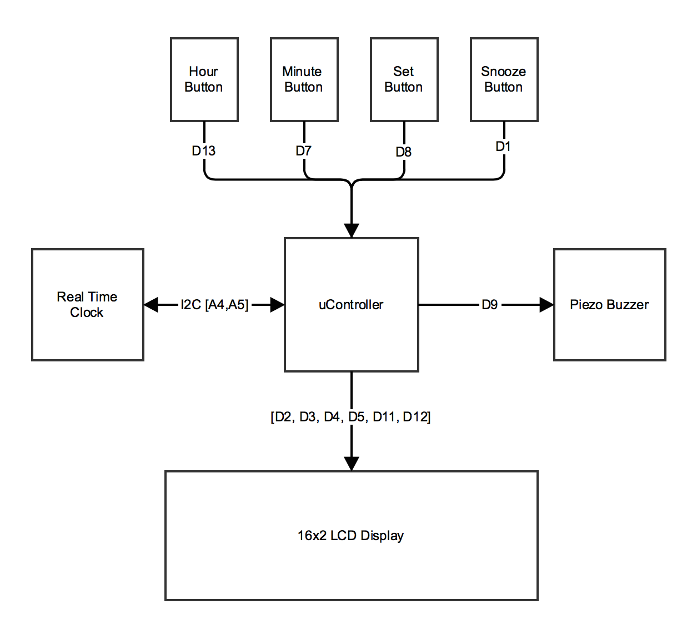
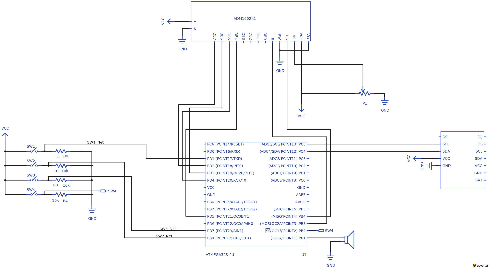
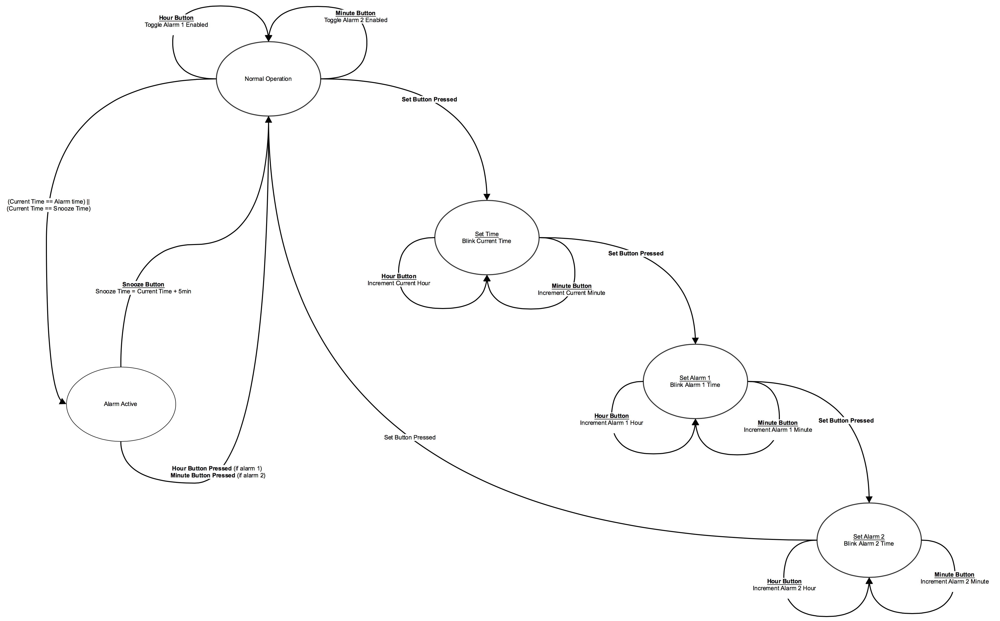

#Alarm Clock 


##The Lab
The purpose of this lab is to build an alarm clock. This alarm clock will have the following functionality: 

* The current time will be displayed on an LCD Display. 
* The user can set the current time 
* The user can set up to 2 alarms for different times
* The user can set each alarm be enabled or disabled
* If an alarm is enabled, it's time will be displayed on the LCD
* If an alarm is disabled, it will show as --:--
* If an alarm is enabled, the alarm clock will buzz until the alarm is disabled
    * While buzzing, the user can hit snooze. This will delay the alarm for 5 minutes.  

###Block Diagram 



###Schematic



###State Transition Diagram



##Suggested Steps

1. Connect the **DS1307 RTC** and use the adafruit library's example code to test that everything works.
1. In your own sketch: set up the **DS1307 RTC** so that it is printing the current time using the **Serial Monitor** as it did in the example code
2. Connect the **Sparkfun 16x2 Liquid Crystal Display** just as you would in Circuit 15 in the Sparkfun Inventors Kit. Use the Sparkfun's example code to test the connection. 
3. Get the current time to appear on the LCD as well as the Serial Monitor. 
4. Set up 2 alarms that can also be displayed on the LCD. When the current time reaches either alarm, call a function that prints to the Serial Monitor. 
5. Connect a buzzer to your circuit, trigger the buzzer in the alarm's function.
6. Wire up 4 buttons (use SIK circuit #5 for reference) and implement their functionality
	7. Hour / Enable	 Alarm 1
	8. Minute / Enable Alarm 2
	9. Set
	10. Snooze


##Code
```c
#include <Wire.h>
#include "RTClib.h"
#include <LiquidCrystal.h>
 
bool DEBUG = true;

RTC_DS1307 rtc;

bool snoozing;
DateTime alarm1;
bool alarm1Enabled;
bool alarm1Active;

DateTime alarm2;
bool alarm2Enabled;
bool alarm2Active;


enum setModeType {
  setModeTypeDisabled,
  setModeTypeCurrentTime,
  setModeTypeAlarm1,
  setModeTypeAlarm2,
  setModeTypeCount
  
};
setModeType setMode;


DateTime currentSetTime;


const int buzzerPin = 9;
const int hourPin = 13;
const int minutePin = 7;
const int setPin = 8;
const int snoozePin = 1;

LiquidCrystal lcd(12,11,5,4,3,2);

void setup() 
{
  // put your setup code here, to run once:
  Serial.begin(9600);
#ifdef AVR
  Wire.begin();
#else
  Wire1.begin(); // Shield I2C pins connect to alt I2C bus on Arduino Due
#endif
  rtc.begin();

  pinMode(buzzerPin, OUTPUT);
  pinMode(hourPin, INPUT);
  pinMode(minutePin, INPUT);
  pinMode(setPin, INPUT); 
  pinMode(snoozePin, INPUT); 


  DateTime now = rtc.now();
  alarm1 = DateTime(now.year(),now.month(),now.day(),6,0,0);
  alarm2 = DateTime(now.year(),now.month(),now.day(),6,0,0);  
  
  
  
  lcd.begin(16, 2);
  lcd.clear();

}

void loop() 
{
  
  
  if (setMode == setModeTypeDisabled) //If we're not in set mode
  {      
      if (debounceRead(setPin)) // Lets see if our button is pressed
      {
        setMode = setModeTypeCurrentTime; // If it is, we're in set mode now
        currentSetTime = rtc.now();
        lcd.clear();
        Serial.println("now in set mode");
      }
      else // if its not, carry on
      {
         updateDisplayNormalOperation();
         monitorAlarmButtons();
         checkAlarms();
      }
  }else //We're in set mode.
  {
    blinkDisplay();
    updateDisplaySetMode();
    monitorHourMinuteButtons();
    
    if (debounceRead(setPin)) //If the button is pressed again, increment.
    {
       lcd.clear();
       setMode=setModeType(int(setMode)+1);
       Serial.println(setMode);
       if (setMode == setModeTypeCount) 
       {
         setMode = setModeTypeDisabled;
         lcd.display();
         setRTCTime();
       } 
     }
  }

}

void setRTCTime()
{
  rtc.adjust(currentSetTime);
}

int buttonStates[4];
int lastButtonStates[4];

int buttonState = LOW;             // the current reading from the input pin
int lastButtonState = LOW;   // the previous reading from the input pin
long lastDebounceTime = 0;  // the last time the output pin was toggled
long debounceDelay = 50;    // the debounce time; increase if the output flickers
long lastChange = 0;


bool debounceRead(int pin)
{
  
  if ((millis() - lastChange) < 200)
  {
    return false;
  }


  switch (pin)
  {
    case hourPin:
    {
      buttonState = buttonStates[0];
      lastButtonState = lastButtonStates[0];
    }
    break;
    case minutePin:
    {
      buttonState = buttonStates[1];
      lastButtonState = lastButtonStates[1];
    }
    break;
    case setPin:
    {
      buttonState = buttonStates[2];
      lastButtonState = lastButtonStates[2];
    }
    break;
    case snoozePin:
    {
      buttonState = buttonStates[3];
      lastButtonState = lastButtonStates[3];
    }
    break;
  }
    
  int reading = digitalRead(pin);

  
  if (reading != lastButtonState) 
  {
    Serial.println("reading is different than last button state");
    lastDebounceTime = millis();
  }


  if ((millis() - lastDebounceTime) > debounceDelay) 
  {
    // whatever the reading is at, it's been there for longer
    // than the debounce delay, so take it as the actual current state:
    // if the button state has changed:
    if (reading != buttonState) 
    {
      
      Serial.println("Button press successful");
      buttonState = reading;
      lastChange = millis();
      return buttonState;
    }
  }
  
    lastButtonState = reading;
    
      switch (pin)
  {
    case hourPin:
    {
      buttonStates[0] = buttonState;
      lastButtonStates[0] = lastButtonState;
    }
    break;
    case minutePin:
    {
      buttonStates[1] = buttonState;
      lastButtonStates[1] = lastButtonState;
    }
    break;
    case setPin:
    {
      buttonStates[2] = buttonState;
      lastButtonStates[2] = lastButtonState;
    }
    break;
    case snoozePin:
    {
      buttonStates[3] = buttonState;
      lastButtonStates[3] = lastButtonState;
    }
    break;
  }

}

void monitorAlarmButtons()
{
 
  if (debounceRead(hourPin))
  {
    alarm1Enabled = !alarm1Enabled;
    Serial.println("hey alarm one is toggled");
  } 
 
  if (debounceRead(minutePin))
  {
    alarm2Enabled = !alarm2Enabled;
  }
}

void monitorHourMinuteButtons()
{
  if (debounceRead(hourPin))
  {
    switch (setMode)
    {
      case setModeTypeCurrentTime:
      {
        currentSetTime = (currentSetTime.unixtime() + 3600); // One hour later.
      }break;
      case setModeTypeAlarm1:
      {
          alarm1 = (alarm1.unixtime() + 3600); // One hour later.
      }break;
      case setModeTypeAlarm2:
      {
          alarm2 = (alarm2.unixtime() + 3600); // One hour later.
      }break;
    }
    
  } 
  
  if (debounceRead(minutePin))
  {
    switch (setMode)
    {
      case setModeTypeCurrentTime:
      {
        currentSetTime = (currentSetTime.unixtime() + 60); // One min later.
      }break;
      case setModeTypeAlarm1:
      {
          alarm1 = (alarm1.unixtime() + 60); // One min later.
      }break;
      case setModeTypeAlarm2:
      {
          alarm2 = (alarm2.unixtime() + 60); // One min later.
      }break;
  }

  }
}

void checkAlarms() 
{
  DateTime now = rtc.now();
  
      //alarm 1
      if (now.hour() == alarm1.hour() &&
          now.minute() == alarm1.minute() &&
          now.second() == alarm1.second())
      {
        //buzz buzz
        Serial.println("alarm 1 buzzing");
        buzzBuzz();
      }
      
      //alarm 2
      if (now.hour() == alarm2.hour() &&
          now.minute() == alarm2.minute() &&
          now.second() == alarm2.second())
      {
        //buzz buzz
        Serial.println("alarm 1 buzzing");
        buzzBuzz();

      }


}

void buzzBuzz() 
{
  tone(buzzerPin, 200, 200);
}

void snoozeHit() 
{

  
}

void updateDisplayNormalOperation() 
{
  static long timeUpdate = 0;
  if (millis() - timeUpdate > 500)
  {
    timeUpdate = millis();
    writeCurrentTime();  
    writeAlarmsStatus();
  }
  
}


void updateDisplaySetMode()
{
  switch (setMode){
    case setModeTypeCurrentTime:
    {
      
      writeTimeOnDisplay(currentSetTime,false,0,0);
    }break;
    case setModeTypeAlarm1:
    {
      writeTimeOnDisplay(alarm1,false,0,1);

    }break;
    case setModeTypeAlarm2:
    {
      writeTimeOnDisplay(alarm2,false,10,1);

    }break;
  }
  

}


bool displayOn = true;
void blinkDisplay()
{
  
  static long lastUpdate;

  if (millis() - lastUpdate > 500)
  {
    lastUpdate = millis();

    displayOn = !displayOn;
    if (displayOn)
    {
       lcd.noDisplay();     
       Serial.println("displayoff");
    }
    else
    {
      lcd.display();
       Serial.println("displayON");
    }

  }
}


void writeAlarmsStatus() 
{ 
  
  
  if (alarm1Enabled) 
  {  
    writeTimeOnDisplay(alarm1,false,0,1);  
  }
  else 
  {
    lcd.setCursor(0,1);
    lcd.print("--:-- ");
  }

  if (alarm2Enabled) 
  {
    writeTimeOnDisplay(alarm2,false,10,1);  
  }  
  else 
  {
    lcd.setCursor(10,1);
    lcd.print("--:-- ");
  }
  

}

void writeCurrentTime()
{
 
  writeTimeOnDisplay(rtc.now(),true,0,0);  
  
  if (DEBUG) 
  {
    DateTime now = rtc.now();
    int armyHour = now.hour();
    if (armyHour > 12) 
    {
      armyHour -= 12;
    }
    Serial.print(armyHour, DEC);
    Serial.print(':');
    Serial.print(now.minute(), DEC);
    Serial.print(':');
    Serial.print(now.second(), DEC);
    Serial.println();
  }
}

void writeTimeOnDisplay(DateTime time, bool withSeconds, int atCharacterIndex, int onLine) 
{
  bool isAM = true;
    int armyHour = time.hour();
    if (armyHour > 12) {
      isAM = false;
      armyHour -= 12;
    }

    lcd.setCursor(atCharacterIndex,onLine);
    if (armyHour < 10) {
      lcd.print('0');
    } 
    lcd.print(armyHour, DEC);

    lcd.print(':');
    if (time.minute() < 10) {
      lcd.print('0');
    } 
    lcd.print(time.minute(), DEC);
    
    if (withSeconds) 
    {
      lcd.print(':');
      if (time.second() < 10) {
        lcd.print('0');
      } 
  
      lcd.print(time.second(), DEC);
    }
    
    if (isAM)
    {
      lcd.print("A");
    }
    else
  {
      lcd.print("P");
  }
}  
```

