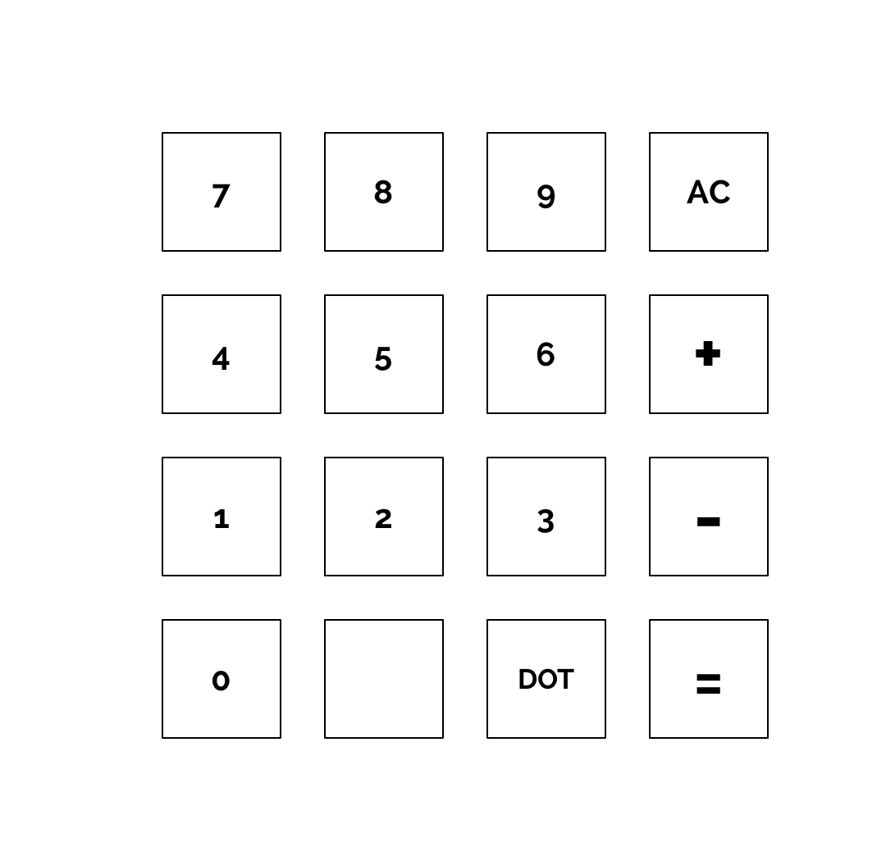

#Calculator 


##The Lab
The purpose of this lab is to build a simple calculator. The calculator shall be able to perform the following functions: 

* Allow the user to enter an integer number 
* Add a second number and show the result when hitting equal or hitting another add or subtract button
* Clear the display back to 0 
* Keep adding or subtracting numbers by hitting plus and minus 
* Have the trellis keypad highlight the button tapped for a short period of time 

###Block Diagram


##Keypad Layout


##Suggested Steps
1. Connect the LCD and Potentiometer (POT) to your Arduino board.
2. Load the example program from Sparkfun Circuit #15 and ensure that the LCD is operating properly. Adjust the POT as necessary to manage contrast.
3. Build the trellis keyboard using the supplied wires, heat shrink tubing, 3D printed case
4. Connect the trellis to your arduino board.
5. Load the Adafruit trellis library and run the TrellisTest Sketch
6. Notice how the trellis sketch reads the trellis keyboard to determine if a key is pressed.
7. Create a new sketch called calculator and implement the basic functionality.
	1. Start with some basic code to read a keypad press and show it's number on your lcd display.
	2. Implement the ability to enter several key presses to make up a number and show that number on the display.
	3. Implement the clear functionality.
	4. Implement the ability to add two numbers.
	5. Highlight the button tapped for 100 ms after it is tapped.
	6. Allow multiple numbers to be added or subtracted.
1. Extra Credit
	1. Add a decimal point to allow for floating point numbers.
	2. Add a +/- button to change the sign of a number so you can enter negative numbers.
	3. Add ability for Clear button to just clear the current number being entered.  If it is tapped twice, then the 2nd tap does an All Clear which clears the result being displayed.

##Code
```Code
#include <LiquidCrystal.h>
#include <Wire.h>
#include "Adafruit_Trellis.h"

#define numKeys 16
LiquidCrystal lcd(12,11,5,4,3,2);
Adafruit_Trellis keypad = Adafruit_Trellis();
char keys[numKeys] = {'C','+','-','=','9','6','3','.','8','5','2',' ','7','4','1','0'};
long result, temp;
char lastOperation = '+';
bool showResult = true;

void LEDSInOrder(bool turnOn)
{
  for (uint8_t i=0; i<numKeys; i++) 
  {
    if (turnOn)
    {
      keypad.setLED(i);
    }
    else
    {
      keypad.clrLED(i);
    }
    keypad.writeDisplay();    
    delay(50);
  }
}

void setup() {
  Serial.begin(9600);
  lcd.begin(16, 2);
  lcd.clear();
  keypad.begin(0x70);
  LEDSInOrder(true);
  LEDSInOrder(false);
  result = 0;
}

char keyPressed()
{
  while (true)
  {
    delay(30);
    if (keypad.readSwitches())
    {
      delay(30);
      // A button has been tapped
      for (uint8_t i=0; i<numKeys; i++)
      {
        if (keypad.justPressed(i))
        {
          keypad.setLED(i);
          keypad.writeDisplay();
          delay(100);
          keypad.clrLED(i);
          keypad.writeDisplay();
          return(keys[i]);
        }
      }
    }
  }
}

double doCalc(double withValue)
{
  switch (lastOperation)
  {
    case '+' :
      return result + withValue;
      break;    
    case '-' :
      return result - withValue;
      break;
    case 'C' :
      return withValue;
    case '=' :
      return result;
  }
}

void loop() {
  lcd.setCursor(0,0);
  char key = keyPressed();
  showResult = true;
  switch (key)
  {
    case 'C' :
      result = 0;
      temp = 0;
      lastOperation = 'C';
      break;
    case '+' :
      result = doCalc(temp);
      lastOperation = '+';
      temp = 0;
      break;
    case '-' :
      result = doCalc(temp);
      lastOperation = '-';
      temp = 0;
      break;
    case '=' :
      result = doCalc(temp);
      lastOperation = '=';
      temp = 0;
      break;
    default :
      uint8_t number = key - '0';
      temp = temp * 10 + number;
      showResult = false;
  }
  if (showResult)
  {
    lcd.clear();
    lcd.print(result);
  }
  else
  {
    lcd.clear();
    lcd.print(temp);
  }
}
```
