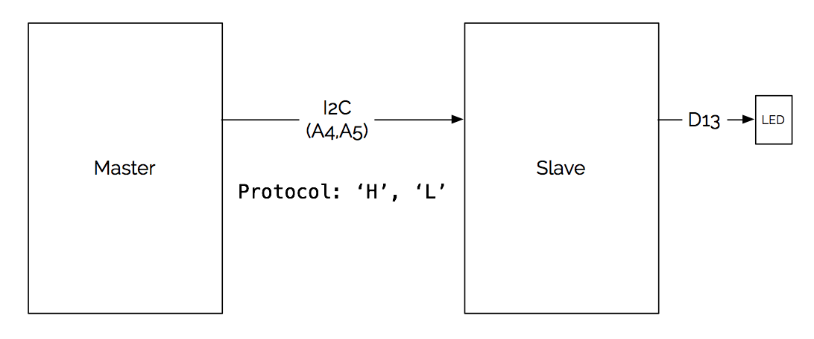

#Blink via I2C

##Setup

In this lab we will be using an Arudino Trinket from Adafruit. This specific board requires a slightly different version of the Arduino IDE (Arduino 1.6x). 

1. Download the [Arduino 1.6x IDE] (https://learn.adafruit.com/adafruit-arduino-ide-setup/arduino-1-dot-6-x-ide) 
2. Launch the new Arduino Application
3. Under the menu **Tools > Boards** select one of the **Pro Trinkets**
4. Under the menu **Tools > Programmer** select **USBtinyISP**
5. Plug in the Trinket: you should see the green LED remain lit, and the red LED pulsing smoothly on and off. **If the red light is not pulsing, this means it is not in bootloading mode. Hit the button on the board to enter bootloading mode**
6. Once the red light is pulsing, load the **Blink** program under **File > Examples > Basics**
7. Now you should see that the blink program has loaded and the trinket's red LED flashes once every second. 


##The Lab
The purpose of this lab is to have one Arduino tell another to blink an LED. We will use I2C to communicate between the two Arduinos. 

Refer to the block diagram below for an overview of what you'll be building.




##Code
###Master
```
#include <Wire.h>
#define LOCALPIN 13
void setup()
{
  Wire.begin();
  //TWBR = 12;
  pinMode(LOCALPIN,OUTPUT);
  Serial.begin(9600);
  Serial.println(TWBR);
  Serial.println(TWSR,HEX);
  Serial.println(F_CPU);
}

void loop()
{
  Wire.beginTransmission(5);
  Wire.write('H');
  Wire.write('L');
  Wire.write('H');
  digitalWrite(LOCALPIN,HIGH);
  Wire.endTransmission();
  
  delay(1000);

  Wire.beginTransmission(5);
  Wire.write('L');
  digitalWrite(LOCALPIN,LOW);
  Wire.endTransmission();
  
  delay(1000); 
 
}
```

###Slave
```
#include <Wire.h>
#define SLAVEPIN 13
#define I2C_SLAVE_ADDRESS 5

void setup()
{
  Wire.begin(I2C_SLAVE_ADDRESS);
  pinMode(SLAVEPIN, OUTPUT);
  digitalWrite(SLAVEPIN, LOW);
  Wire.onReceive(receiveEvent);
}

void receiveEvent(int byteCountReceived)
{
  
//  while (Wire.available())
//  {
//    char c = Wire.read();
//    
//    if (c == 'H')
//    {
//      digitalWrite(SLAVEPIN,HIGH);
//    }
//    else
//    {
//      digitalWrite(SLAVEPIN,LOW);
//    }
  
      for (int i = 0; i<byteCountReceived;i++) 
      {
       digitalWrite(SLAVEPIN,HIGH);
       delay(1000); 
      digitalWrite(SLAVEPIN,LOW);
       delay(1000); 
    }
//  }
}
void loop()
{

}
```